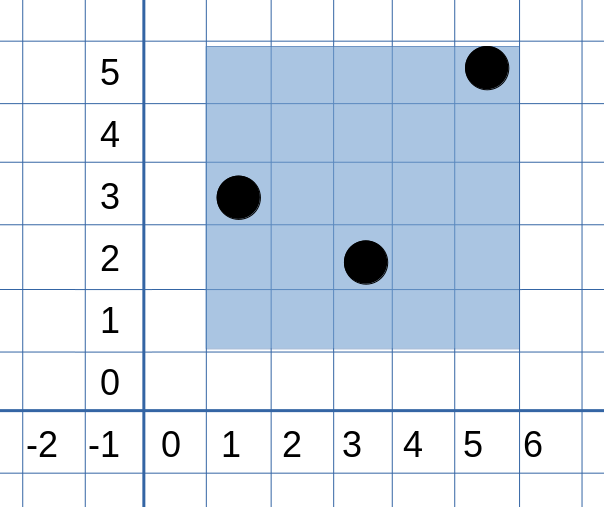

# 你画我数

时限 1500ms
空间 256MB

## 题目描述
GR和CR是一对好朋友，GR喜欢数数，CR喜欢画画。CR有一张很大的空白画布，每次她可以：

1. `add x y` 在 $(x,y)$ 处画一个点（保证画点之前 $(x,y)$ 是空白的）
2. `remove x y` 把点 $(x,y)$ 擦掉（保证擦掉前 $(x,y)$ 存在点）
3. `query x1 y1 x2 y2` 询问GR：以 $(x_1,y_1)$ 为左下角,  $(x_2,y_2)$ 为右上角的矩形，覆盖了多少点

因为有很多点，GR找到了你，让你写一个程序帮她数数。



## 输入

第一行有一个正整数 $n$ ($1 \le n \le 10^5)$
接下来 $n$ 行，每行有一个命令，格式已在描述中给出
座标保证为 $[-10^9, 10^9]$ 之间的整数，矩形保证 $x_1 \le x_2$, $y_1 \le y_2$

## 输出

对每个询问，输出被矩形覆盖的点的个数

## 样例输入
```
7
add 1 3
add 3 2
add 5 5
query 1 1 5 5
remove 3 2
remove 5 5
query 1 1 5 5
```

## 样例输出
```
3
1
```
